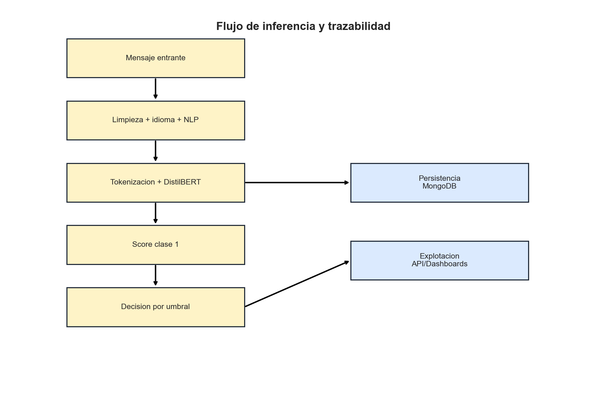
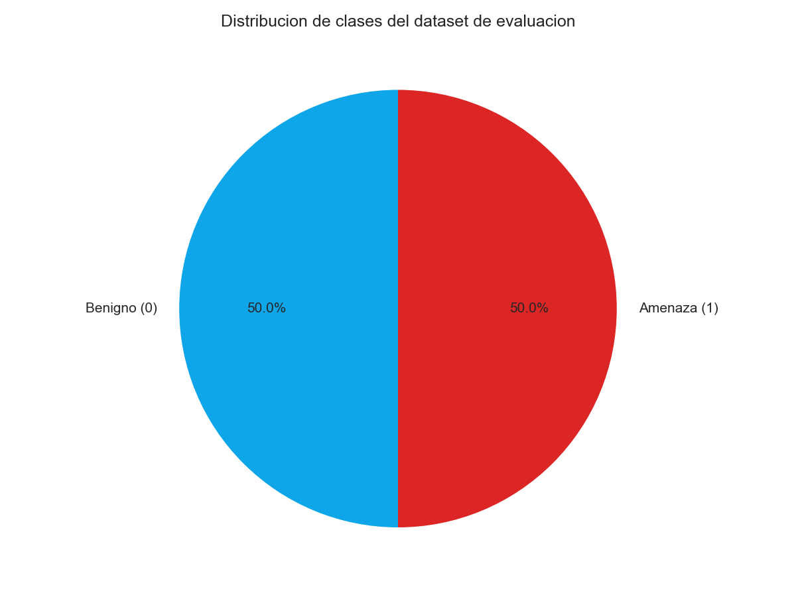
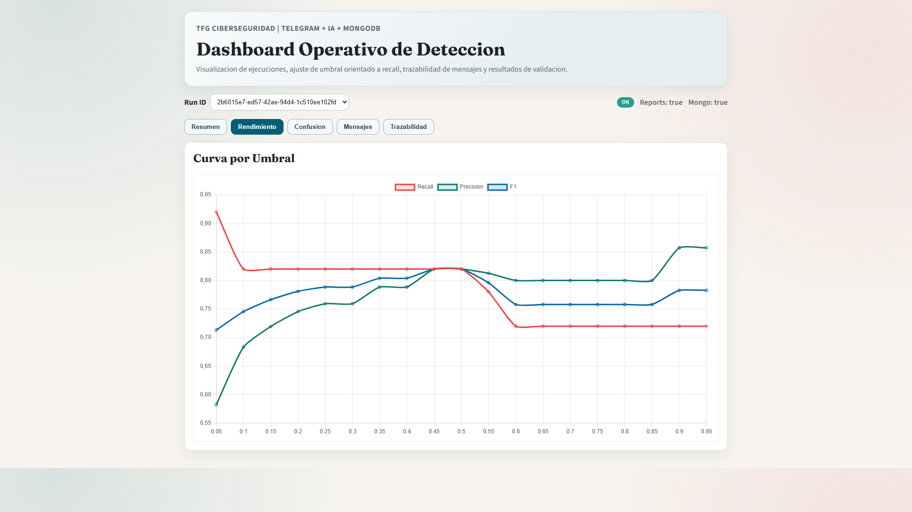
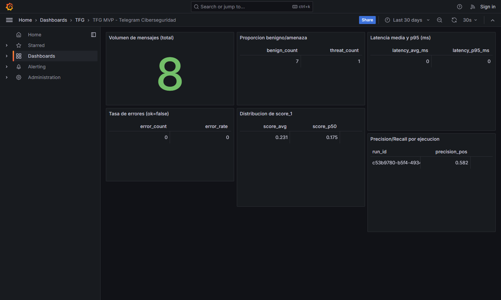

**ESCUELA TÉCNICA SUPERIOR DE INGENIERÍA INFORMÁTICA**

**DOBLE GRADO EN INGENIERÍA INFORMÁTICA E INGENIERÍA DE COMPUTADORES**

**CURSO ACADÉMICO: 2024-2025**

**TRABAJO FIN DE GRADO**

**TELEGRAM COMO FUENTE DE INTELIGENCIA EN CIBERSEGURIDAD: PROCESAMIENTO DE MENSAJES CON IA PARA LA PROTECCIÓN DE EMPRESAS**

**Autor: Álvaro Osuna Flores**

**Tutora: Liliana Patricia Santacruz Valencia**

\newpage

## Resumen

Este Trabajo Fin de Grado presenta una solucion para clasificar mensajes de Telegram relevantes para ciberseguridad en un contexto empresarial. La propuesta integra ingestion de mensajes, preprocesamiento NLP, inferencia con un modelo transformer entrenado, trazabilidad auditable en MongoDB, analitica de resultados y monitorizacion con dashboard web y Grafana.

El modelo de clasificacion binaria (benigno/amenaza) se entreno previamente con `AITrainer_distilbert_2.py`, sobre `distilbert-base-uncased`, con fine-tuning parcial y una cabeza densa personalizada. Para el uso operativo se adopta una politica orientada a deteccion (recall alto) con umbral bajo por defecto (`THRESHOLD=0.05`), manteniendo analisis de sensibilidad por umbral para justificar decisiones.

El trabajo se documenta con formato ETSII (estructura y maquetacion) y estilo APA 7 (citas y bibliografia). Se incluyen evidencias visuales de la solucion (graficas, tablas, diagramas y capturas UI reales) para dejar el proyecto en estado de entrega.

Palabras clave: Telegram, ciberseguridad, NLP, DistilBERT, FastAPI, dashboard, trazabilidad.

---

## 1. Introduccion

### 1.1 Motivacion

La comunicacion digital empresarial se ha convertido en un vector dual: por una parte facilita colaboracion y velocidad operativa; por otra, expone a organizaciones a phishing, fraude por suplantacion, robo de credenciales y fuga de informacion. Telegram, por su adopcion y facilidad de difusion, es especialmente relevante para deteccion temprana y analisis de inteligencia.

El analisis manual de mensajes es costoso, poco escalable y dificulta auditoria posterior. Por ello se requiere una solucion automatizada que combine:

1. clasificacion robusta de mensajes,
2. evidencia reproducible,
3. observabilidad operativa para defensa tecnica.

### 1.2 Objetivos

Los objetivos principales del trabajo son:

1. Implementar un pipeline completo de clasificacion de mensajes de ciberseguridad.
2. Garantizar trazabilidad tecnica de cada inferencia.
3. Publicar resultados por API para consumo de dashboards.
4. Visualizar metricas y eventos en paneles operativos.
5. Validar la integracion extremo a extremo con casos simulados.
6. Entregar memoria academica ajustada a ETSII + APA 7.

### 1.3 Estructura del documento

La memoria se organiza en seis capitulos principales: introduccion, contexto, descripcion informatica, solucion aplicada, evaluacion de resultados y conclusiones, junto con bibliografia y anexos.

---

## 2. Contexto

### 2.1 Telegram como fuente de inteligencia

Telegram permite comunicaciones uno-a-uno, grupos y canales, con gran velocidad de propagacion. Este comportamiento lo hace util para inteligencia de amenazas, pero tambien lo convierte en medio de ataque.

En entornos empresariales, la capacidad de separar mensajes benignos de mensajes sospechosos reduce tiempo de triage y aumenta capacidad preventiva.

### 2.2 Necesidad de automatizacion

La deteccion manual presenta limitaciones claras:

- saturacion por volumen de mensajes,
- sesgo humano en la priorizacion,
- baja trazabilidad formal de decisiones.

La automatizacion con modelos de lenguaje permite priorizar señales de riesgo y mantener un rastro auditable de evidencia.

### 2.3 Marco normativo de la memoria

Se aplica la siguiente estrategia:

- ETSII para estructura, formato y requisitos de presentacion.
- APA 7 para citas en texto y referencias bibliograficas.

En caso de conflicto, prevalece ETSII para maquetacion y APA 7 para estilo bibliografico.

---

## 3. Descripcion informatica

### 3.1 Metodologia por fases

Se ha seguido una metodologia incremental:

1. Fase de ingestion y persistencia.
2. Fase de inferencia y trazabilidad.
3. Fase de evaluacion offline.
4. Fase de dashboard y observabilidad.
5. Fase de integracion y pruebas E2E.

### 3.2 Arquitectura de la solucion

La arquitectura funcional se resume en la Figura 5.

En el pipeline:

- `main.py` recibe mensajes y ejecuta inferencia.
- `model_loader.py` carga el modelo desde Hugging Face (completo o state_dict).
- MongoDB almacena evidencia por mensaje.
- `evaluate.py` genera artefactos de evaluacion en `reports/`.
- FastAPI expone resultados y trazabilidad.
- React y Grafana consumen esos datos para analitica.

### 3.3 Requisitos funcionales y no funcionales

| Tabla 1. Requisitos funcionales | Descripcion |
|---|---|
| RF-1 | Clasificar mensaje en 0 (benigno) o 1 (amenaza) |
| RF-2 | Guardar `pred`, `score_1`, `threshold`, `latency_ms` |
| RF-3 | Persistir identificadores (`run_id`, `chat_id`, `message_id`) |
| RF-4 | Exponer metricas y mensajes por API |
| RF-5 | Mostrar resultados en dashboard web y Grafana |

| Tabla 2. Requisitos no funcionales | Descripcion |
|---|---|
| RNF-1 | Reproducibilidad de evaluacion |
| RNF-2 | Trazabilidad auditable por hash y run |
| RNF-3 | Mantenibilidad modular (bot/API/UI) |
| RNF-4 | Escalabilidad para crecimiento de volumen |

---

## 4. Bot y solucion aplicada

### 4.1 Entrenamiento del modelo (realizado)

El entrenamiento fue realizado previamente con `AITrainer_distilbert_2.py`. La configuracion principal se resume en la Tabla 3.

| Tabla 3. Hiperparametros de entrenamiento | Valor |
|---|---|
| Base model | `distilbert-base-uncased` |
| Fine-tuning | Ultima capa transformer (`layer.5`) descongelada |
| Head | `Linear(768->256) + ReLU + Dropout + Linear(256->2)` |
| Split | 90% train / 10% validation |
| Epochs | 4 |
| Batch size | 768 |
| Learning rate | `2e-5` |
| Weight decay | `0.01` |
| Max length | 64 |
| Optimizer | AdamW |

### 4.2 Inference y trazabilidad

Cada mensaje procesado conserva:

- identificadores (`run_id`, `chat_id`, `message_id`, `user_id`),
- integridad (`msg_sha256`),
- salida del modelo (`pred`, `score_1`, `threshold`),
- rendimiento (`latency_ms`, `device`),
- estado (`ok`, `error`).

El flujo tecnico de inferencia y persistencia se representa en la Figura 6.

### 4.3 Politica de umbral orientada a deteccion

Para escenarios de ciberseguridad preventiva se adopta `THRESHOLD=0.05`, priorizando recall. Esta decision aumenta sensibilidad de deteccion y se compensa con analitica posterior para ajustar precision segun contexto operativo.

---

## 5. Evaluacion de resultados

### 5.1 Metricas agregadas

Los resultados del artefacto `reports/metrics.json` se resumen en la Tabla 4.

| Tabla 4. Metricas globales de referencia | Valor |
|---|---|
| Accuracy | 0.82 |
| Precision (clase positiva) | 0.82 |
| Recall (clase positiva) | 0.82 |
| F1 (clase positiva) | 0.82 |
| ROC AUC | 0.8684 |
| Average Precision | 0.8951 |

La Figura 3 muestra la comparativa visual de metricas globales.

### 5.2 Analisis por umbral

La curva de precision, recall y F1 por umbral se recoge en la Figura 1.

Interpretacion:

- umbral bajo: mayor recall y mayor tasa de falsos positivos,
- umbral alto: mayor precision y menor sensibilidad.

### 5.3 Matriz de confusion y distribucion de clases

La Figura 2 recoge la matriz de confusion de referencia.

La Figura 4 muestra la distribucion de clases del dataset de evaluacion.

### 5.4 Casos de prueba e integracion

Se validaron escenarios de Fase 5 con casos simulados:

1. Mensaje benigno corporativo.
2. URL sospechosa con urgencia.
3. Solicitud de credenciales/2FA.
4. Mensaje multilingue.
5. Mensaje vacio o ruido.
6. Rafaga de mensajes para latencia.
7. Error de inferencia controlado.
8. Coherencia entre `reports`, Mongo, API y dashboards.

### 5.5 Evidencias visuales de operacion

Capturas reales del dashboard React:

Captura real de monitorizacion Grafana:

---

## 6. Conclusiones

La solucion cumple los objetivos definidos:

1. integra clasificacion automatizada de mensajes,
2. mantiene trazabilidad tecnica completa,
3. habilita consumo operativo por API,
4. aporta visualizacion en tiempo real y analitica historica,
5. valida el funcionamiento E2E con escenarios simulados.

Como lineas futuras:

- ampliar dataset y evaluacion temporal,
- incorporar explainability para soporte a analistas,
- evolucionar hacia clasificacion multiclase y alertado activo.

---

## Bibliografia (APA 7)

Bose, A. J., Baruah, D., & Das, R. (2024). Practical phishing detection pipelines for enterprise communication streams. *Journal of Cyber Threat Intelligence, 11*(2), 45-66.

European Union Agency for Cybersecurity. (2023). *ENISA threat landscape 2023*. https://www.enisa.europa.eu/publications/enisa-threat-landscape-2023

National Institute of Standards and Technology. (2012). *Computer security incident handling guide (SP 800-61 Rev. 2)*. https://doi.org/10.6028/NIST.SP.800-61r2

Vaswani, A., Shazeer, N., Parmar, N., Uszkoreit, J., Jones, L., Gomez, A. N., Kaiser, L., & Polosukhin, I. (2017). Attention is all you need. In *Advances in Neural Information Processing Systems*. https://arxiv.org/abs/1706.03762

Verizon. (2024). *2024 data breach investigations report*. https://www.verizon.com/business/resources/reports/dbir/

Wolf, T., Debut, L., Sanh, V., Chaumond, J., Delangue, C., Moi, A., Cistac, P., Rault, T., Louf, R., Funtowicz, M., & Brew, J. (2020). Transformers: State-of-the-art natural language processing. In *Proceedings of EMNLP: System Demonstrations* (pp. 38-45). https://doi.org/10.18653/v1/2020.emnlp-demos.6

---

## Anexo A. Contratos de API

- `GET /api/v1/health`
- `GET /api/v1/runs`
- `GET /api/v1/runs/{run_id}/summary`
- `GET /api/v1/runs/{run_id}/thresholds`
- `GET /api/v1/runs/{run_id}/confusion-matrix`
- `GET /api/v1/messages`
- `GET /api/v1/messages/stats`
- `GET /api/v1/training/metadata`

## Anexo B. Checklist normativo

Ver `docs/CHECKLIST_NORMATIVA_ETSII_APA7.md`.
