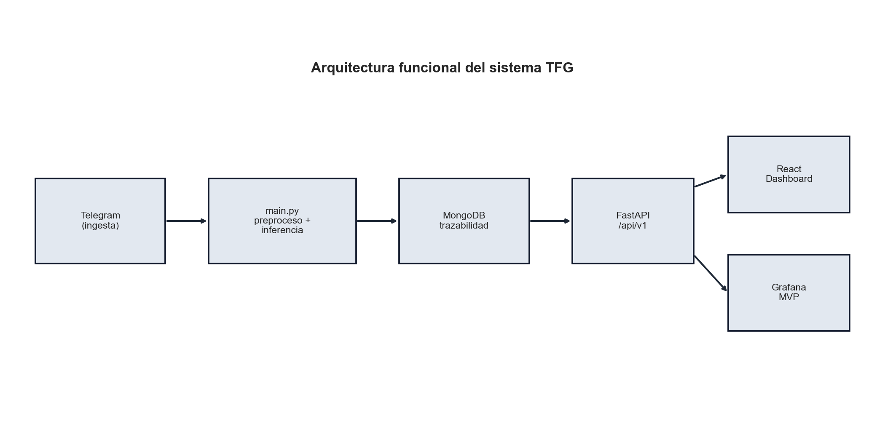
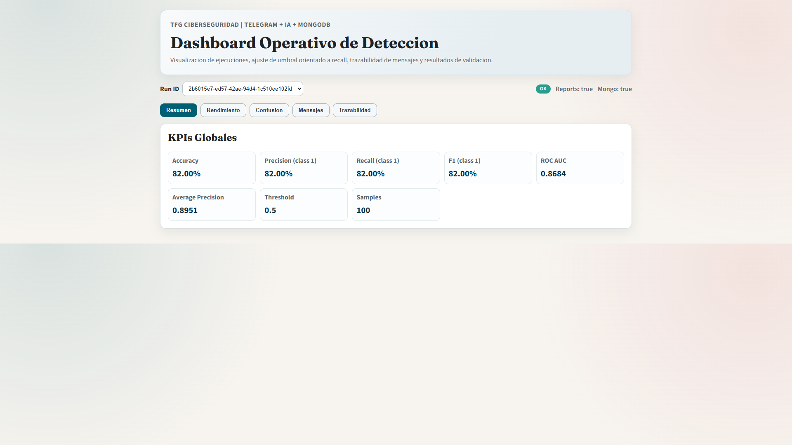
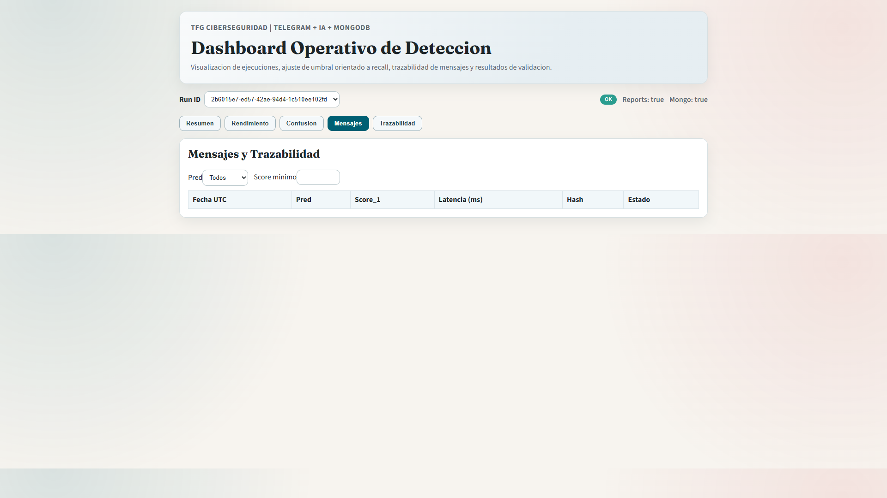
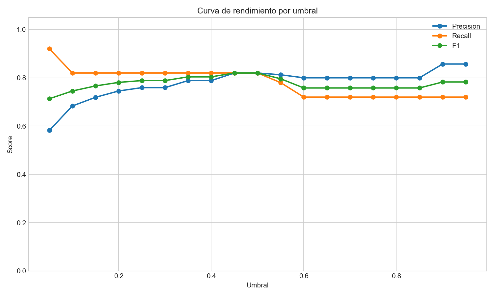
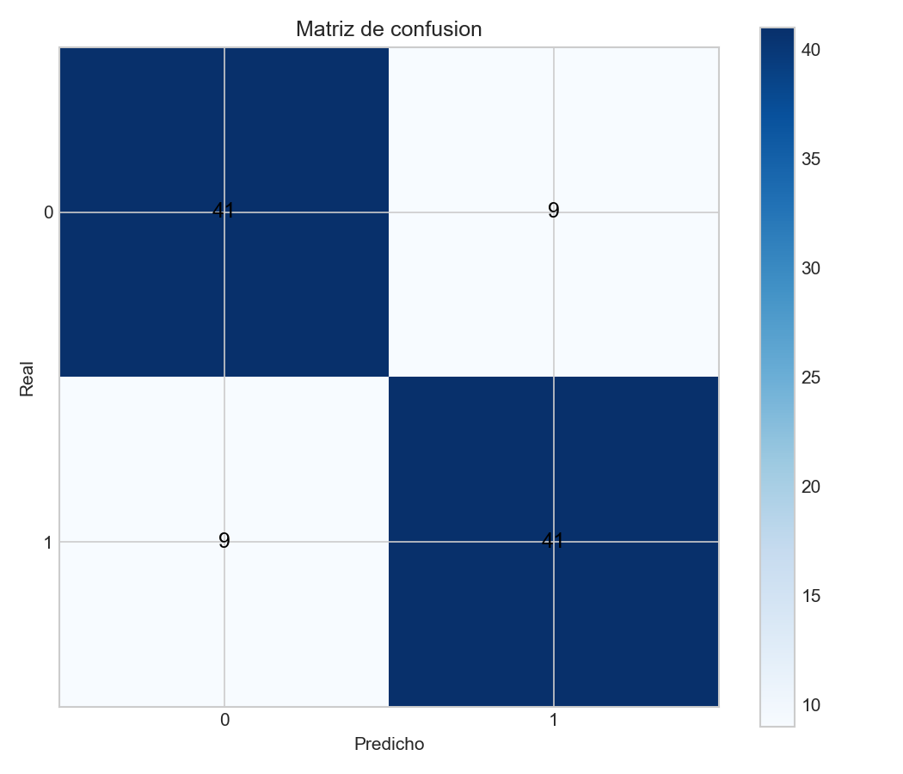
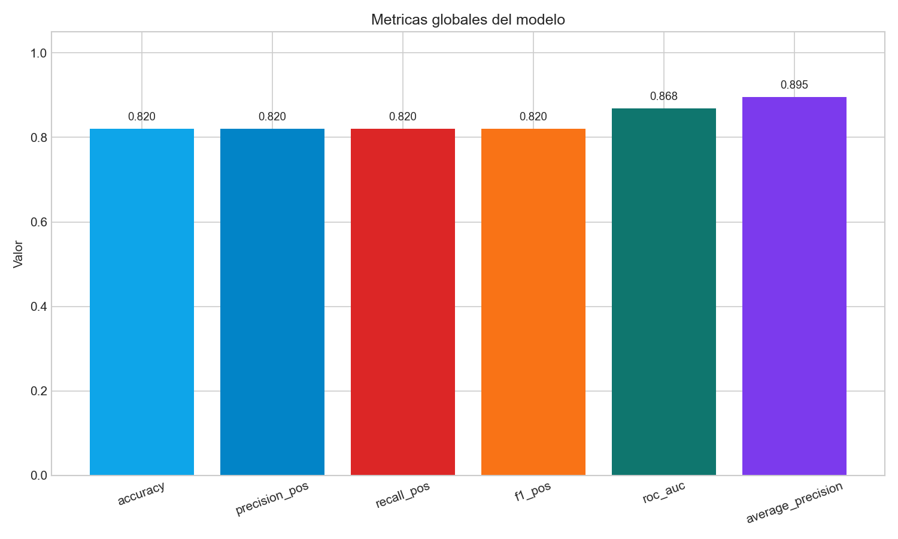

ESCUELA TECNICA SUPERIOR DE INGENIERIA INFORMATICA

DOBLE GRADO EN INGENIERIA INFORMATICA E INGENIERIA DE COMPUTADORES

CURSO ACADEMICO 2025-2026

TRABAJO FIN DE GRADO

# TELEGRAM COMO FUENTE DE INTELIGENCIA EN CIBERSEGURIDAD: PIPELINE DE DETECCION DE PHISHING Y MENSAJES SOSPECHOSOS PARA ENTORNOS EMPRESARIALES

Autor: Alvaro Osuna Flores

Tutora: Liliana Patricia Santacruz Valencia

## Resumen

Este Trabajo Fin de Grado presenta el diseno e integracion de un sistema para detectar mensajes de phishing y comunicaciones sospechosas procedentes de Telegram. El proyecto se ha planteado desde una perspectiva propia de Ingenieria de Computadores: no se limita a una tarea de clasificacion aislada, sino que organiza un pipeline operativo que cubre ingesta, preprocesado, inferencia, persistencia, exposicion de resultados, monitorizacion y validacion integrada.

La solucion combina Telethon para la escucha de mensajes, un modelo de lenguaje basado en DistilBERT para la inferencia binaria, MongoDB para la persistencia trazable, FastAPI para la publicacion de resultados y paneles React y Grafana para la explotacion operativa. Sobre esa base, se incorporan medidas de seguridad minima para evitar exposiciones innecesarias: API protegida con `X-API-Key`, CORS restringido, Grafana sin acceso anonimo y minimizacion de datos almacenados por defecto.

Los artefactos de evaluacion se versionan por `run_id`, lo que permite relacionar de forma coherente metricas, predicciones, matriz de confusion y evidencias de validacion con una ejecucion concreta. En la evaluacion offline del sistema, realizada sobre 100 muestras balanceadas, se obtuvo `accuracy=0.63`, `precision_pos=0.5823`, `recall_pos=0.92`, `f1_pos=0.7132`, `roc_auc=0.8684` y `average_precision=0.8951`, manteniendo `THRESHOLD=0.05` para priorizar deteccion temprana.

La principal aportacion del trabajo no es solo el modelo, sino la integracion de componentes en un flujo trazable y defendible, orientado a un escenario realista de operacion y pensado para poder desplegarse, mantenerse y auditarse como un sistema tecnico coherente.

Palabras clave: Telegram, phishing, ciberseguridad, pipeline, FastAPI, MongoDB, Grafana, trazabilidad, DistilBERT.

## 1. Introduccion

### 1.1 Motivacion

Telegram se ha convertido en un entorno de interes para la ciberseguridad por dos motivos complementarios. Por un lado, es una plataforma ampliamente utilizada para comunicacion legitima, coordinacion y difusion rapida de mensajes. Por otro, sus canales, grupos y dinamica de propagacion facilitan tambien la distribucion de enlaces fraudulentos, senuelos de phishing, credenciales comprometidas o conversaciones relevantes para la inteligencia de amenazas (Europol, 2022; Guo et al., 2024).

Desde una perspectiva operacional, el problema no consiste solo en clasificar texto. El reto real es construir un sistema capaz de recibir mensajes en tiempo casi real, tratarlos de manera consistente, decidir con que evidencia se almacenan, exponer resultados a otros componentes y mantener observabilidad suficiente para su revision posterior. Esa naturaleza integrada hace que el proyecto encaje especialmente bien en Ingenieria de Computadores.

Ademas, un analisis manual continuo resulta costoso, poco escalable y propenso a errores. En consecuencia, es razonable automatizar la primera clasificacion, siempre que el sistema deje trazabilidad tecnica suficiente para justificar la salida producida y para explicar como se ha llegado a ella.

### 1.2 Objetivos

Los objetivos planteados para este trabajo son los siguientes.

Objetivo general

Desarrollar un pipeline modular para capturar, procesar y clasificar mensajes de Telegram relacionados con phishing o actividad sospechosa, integrando almacenamiento, publicacion de resultados y monitorizacion tecnica para su uso en un contexto empresarial.

Objetivos especificos

1. Implementar la ingesta automatica de mensajes desde Telegram mediante su API.
2. Integrar un flujo de preprocesado e inferencia con un modelo binario entrenado previamente.
3. Persistir evidencia tecnica suficiente en MongoDB sin almacenar por defecto mas datos sensibles de los estrictamente necesarios.
4. Versionar los artefactos de evaluacion por `run_id` para mantener coherencia entre ejecuciones, metricas y endpoints.
5. Exponer resultados mediante una API reutilizable y visualizarlos en un dashboard web y en Grafana.
6. Validar el sistema con pruebas de API, evaluacion offline y casos simulados de integracion.

### 1.3 Estructura del documento

La memoria se organiza en seis bloques. En primer lugar se presenta el contexto del problema y la justificacion tecnica del enfoque adoptado. A continuacion se describe la metodologia, la arquitectura y los requisitos. Despues se detalla el desarrollo del pipeline, la integracion entre componentes y las decisiones de almacenamiento y seguridad. Finalmente se analizan los resultados, las limitaciones detectadas y las conclusiones del trabajo.

## 2. Contexto

### 2.1 Telegram como superficie de interes en ciberseguridad

La literatura reciente y los informes del sector coinciden en que Telegram se ha consolidado como una fuente dual: sirve tanto para comunicaciones legitimas como para actividades ilicitas y de coordinacion criminal (Europol, 2022; Guo et al., 2024). Esa dualidad lo convierte en un espacio util para la inteligencia temprana en ciberseguridad.

Para una empresa, esto tiene una consecuencia clara: conviene disponer de mecanismos que permitan observar, filtrar y priorizar mensajes potencialmente peligrosos sin depender exclusivamente de la revision manual. De forma particular, el phishing sigue siendo una de las amenazas mas frecuentes y mas efectivas, por lo que detectar indicadores tempranos en mensajes o enlaces compartidos puede reducir el tiempo de reaccion.

### 2.2 Necesidad de un enfoque de sistemas

En este trabajo no basta con responder si un mensaje parece benigno o sospechoso. La pregunta relevante es mas amplia:

- como llega el mensaje al sistema;
- como se procesa y clasifica;
- que datos se conservan;
- como se audita la ejecucion;
- como se consumen los resultados desde otros componentes.

Estas preguntas obligan a pensar el problema como un pipeline de sistemas. Por eso, el proyecto no se ha orientado solo a la mejora de un clasificador, sino al ensamblaje de varios modulos coordinados que permitan desplegar la solucion, validarla y operarla.

### 2.3 Soluciones relacionadas y hueco del proyecto

Existen soluciones comerciales y academicas para monitorizar fuentes abiertas, orquestar indicadores o aplicar modelos de lenguaje a ciberseguridad. Sin embargo, muchas de esas soluciones son generalistas, costosas o estan poco centradas en una integracion ligera y modular sobre Telegram. El hueco que cubre este TFG consiste en demostrar una arquitectura defendible, con tecnologias accesibles y con especial atencion a:

- portabilidad mediante Docker;
- almacenamiento flexible en MongoDB;
- interfaz de consulta basada en API;
- capa ligera de visualizacion;
- trazabilidad por ejecucion.

### 2.4 Criterio de seguridad minima

La revision de tutoria obligo a reforzar el sistema en un aspecto importante: la explotacion minima segura. A partir de esa revision se fijaron cinco criterios:

1. no publicar MongoDB al exterior por defecto;
2. exigir autenticacion simple en la API;
3. desactivar acceso anonimo en Grafana;
4. restringir CORS a origenes concretos;
5. minimizar los datos personales o textuales persistidos en MongoDB.

Este conjunto de decisiones no convierte el sistema en una plataforma final de produccion, pero si lo hace mas coherente y defendible desde el punto de vista tecnico.

## 3. Metodologia, requisitos y arquitectura

### 3.1 Metodologia de trabajo

El proyecto se ha desarrollado con una metodologia incremental. Primero se construyo el nucleo minimo funcional de captura, inferencia y almacenamiento. Posteriormente se anadieron la evaluacion offline, la API, el dashboard React, los paneles de Grafana y, por ultimo, los mecanismos de validacion y endurecimiento minimo. Esta forma de trabajo ha permitido mantener un MVP operativo en todo momento e ir reforzando sus puntos debiles detectados durante la tutoria.

### 3.2 Requisitos funcionales

| Codigo | Requisito |
| --- | --- |
| RF-1 | Capturar mensajes de Telegram en tiempo real mediante Telethon. |
| RF-2 | Preprocesar el texto y ejecutar inferencia binaria con un modelo transformer. |
| RF-3 | Guardar una traza tecnica minima y pseudonimizada en MongoDB. |
| RF-4 | Generar artefactos reproducibles de evaluacion por `run_id`. |
| RF-5 | Publicar resultados mediante API y visualizarlos en React y Grafana. |
| RF-6 | Validar el comportamiento con pruebas automatizadas y casos simulados. |

### 3.3 Requisitos no funcionales

| Codigo | Requisito |
| --- | --- |
| RNF-1 | La solucion debe ser modular y facil de desplegar localmente. |
| RNF-2 | La evaluacion debe ser reproducible y separable del flujo en tiempo real. |
| RNF-3 | Los resultados deben ser trazables por ejecucion y por artefacto. |
| RNF-4 | La persistencia por defecto debe reducir la exposicion de datos sensibles. |
| RNF-5 | La capa de explotacion debe incluir controles minimos de acceso. |

### 3.4 Arquitectura general del pipeline

La arquitectura se organiza en cinco bloques:

1. captura de mensajes desde Telegram;
2. preprocesado e inferencia;
3. persistencia y versionado de artefactos;
4. publicacion y consulta mediante API;
5. monitorizacion y visualizacion.

En terminos practicos, `main.py` representa la capa de entrada operativa; `evaluate.py` desacopla la evaluacion reproducible; `api/` publica resultados; `dashboard-react/` y `grafana/` consumen la informacion; y `scripts/` automatiza la validacion integrada.

### 3.5 Flujo operativo y trazabilidad

El flujo real que sigue un mensaje es el siguiente:

1. Telegram entrega un mensaje al cliente autenticado.
2. El sistema normaliza el texto y detecta su idioma.
3. El modelo calcula la probabilidad de amenaza y decide la clase final segun un umbral configurable.
4. Se genera una traza con identificadores pseudonimizados, hash del mensaje, score, latencia y metadatos del modelo.
5. La informacion queda disponible para consulta, auditoria y visualizacion.

Esta secuencia es precisamente la que refuerza el enfoque de sistemas del TFG. La salida del modelo no se trata como un dato aislado, sino como un evento que atraviesa varias capas del pipeline.

### 3.6 Herramientas y tecnologias

| Categoria | Herramientas | Funcion dentro del sistema |
| --- | --- | --- |
| Ingesta | Python, Telethon | Conexion a Telegram y recepcion de mensajes |
| IA | Hugging Face Transformers, PyTorch | Carga del modelo e inferencia binaria |
| Persistencia | MongoDB | Almacenamiento flexible y TTL de evidencias |
| Explotacion | FastAPI | Publicacion de resultados por endpoints |
| Visualizacion | React, Grafana | Consulta operativa y panelizacion |
| Integracion | Docker, docker compose | Orquestacion local de componentes |
| Calidad | pytest, scripts de validacion | Verificacion tecnica del sistema |

### 3.7 Infraestructura y despliegue

El proyecto esta preparado para ejecutarse localmente mediante `docker compose`, manteniendo separados los contenedores principales y el frontend. La eleccion de esta infraestructura ligera responde a dos objetivos: facilitar la reproducibilidad del TFG y mantener un diseno modular en el que cada componente pueda evolucionar de forma independiente.

El endurecimiento minimo introducido en `docker-compose.yml` evita la exposicion publica de MongoDB y deja la API y Grafana sujetas a controles de acceso mas razonables para un MVP defendible.

## 4. Desarrollo e integracion del sistema

### 4.1 Ingesta y gestion de sesion con Telegram

El punto de entrada operativo se encuentra en `main.py`. El sistema valida la presencia de `TELEGRAM_API_ID`, `TELEGRAM_API_HASH` y `TELEGRAM_PHONE`, crea la sesion local de Telethon y se conecta a Telegram. Si la cuenta no esta autorizada, solicita codigo y, cuando procede, segundo factor.

Una vez iniciada la sesion, el cliente queda suscrito a eventos `NewMessage`. Cada mensaje recibido se procesa en tiempo real y se transforma en un documento tecnico apto para almacenamiento.

### 4.2 Preprocesado e inferencia

El preprocesado actual incluye normalizacion basica del texto, reduccion de espacios, conversion a minusculas y limpieza de caracteres. Despues se ejecuta la inferencia con el modelo DistilBERT cargado desde Hugging Face y, cuando procede, desde un `state_dict` entrenado previamente.

La salida principal del modelo es `score_1`, interpretado como probabilidad de amenaza. La decision binaria final se calcula aplicando `THRESHOLD`. En el estado actual del proyecto se mantiene `THRESHOLD=0.05` para priorizar recall alto y comportarse como un sistema de deteccion temprana, aunque el analisis por umbral demuestra que hay puntos de trabajo mas equilibrados para otros contextos operativos.

### 4.3 Persistencia y minimizacion de datos

La coleccion MongoDB no guarda por defecto el texto original. El documento base incluye:

- `run_id`;
- `created_at_utc`;
- `user_hash` y `chat_hash`;
- `message_id`;
- `msg_sha256`;
- `idioma`;
- `pred`, `score_1` y `latency_ms`;
- `threshold`, `hf_model`, `model_source` y `device`;
- `ok` y `error`.

Esta estrategia ofrece un equilibrio util entre trazabilidad y privacidad. El sistema conserva una huella del contenido, identifica la ejecucion concreta y permite auditar la inferencia sin almacenar necesariamente texto sensible o identificadores directos.

### 4.4 Versionado de artefactos por ejecucion

Una mejora estructural importante fue dejar de tratar la evaluacion como un estado global unico. A partir de la revision, `evaluate.py` crea artefactos en `reports/runs/<run_id>/` y solo mantiene una copia rapida del ultimo resultado en la raiz de `reports/`.

Esta decision afecta a toda la capa de explotacion:

- la API puede servir la matriz de confusion o el analisis por umbral correctos para un `run_id` concreto;
- el dashboard React consulta datos coherentes con la ejecucion seleccionada;
- Grafana y los scripts de validacion pueden referenciar artefactos versionados.

### 4.5 API y capa de consulta

La API FastAPI actua como interfaz intermedia entre la persistencia y las herramientas de explotacion. Expone endpoints para salud, ejecuciones, resumen de metricas, umbrales, matriz de confusion, mensajes y metadatos de entrenamiento. Para evitar una superficie de exposicion innecesaria, todos los endpoints requieren `X-API-Key`.

La aplicacion utiliza una construccion perezosa (`LazyFastAPIApp`) para evitar que la importacion falle cuando aun no se han definido ciertas variables de entorno. Esa decision mejora la robustez del proyecto y facilita las pruebas automatizadas.

### 4.6 Dashboard React y Grafana

La capa web permite consultar rapidamente el estado de las ejecuciones y el comportamiento del sistema desde una interfaz mas accesible. React se utiliza como frontend operativo de detalle, mientras que Grafana se reserva para una visualizacion mas sintesis y mas orientada a monitorizacion.

Ademas del resumen ejecutivo y la vista de mensajes, el dashboard incorpora una pantalla de rendimiento que facilita revisar la evolucion de las metricas principales y contrastarlas con los artefactos de evaluacion generados por `run_id`.

La coexistencia de ambas capas refuerza la idea de pipeline explotable: la API sirve como contrato tecnico comun, React se orienta a revision funcional y Grafana a observabilidad.

### 4.7 Validacion integrada

El proyecto incorpora varios niveles de verificacion:

- pruebas `pytest` para la API;
- evaluacion offline reproducible;
- simulacion de casos operativos con `scripts/simulate_cases.py`;
- runner de integracion con `scripts/run_phase5_checks.py`.

La observacion practica de tutoria sobre `pytest -q` frente a `python -m pytest -q` ha quedado resuelta con `pytest.ini`, de forma que ambas formas de ejecucion funcionan correctamente sobre el proyecto.

## 5. Evaluacion y analisis de resultados

### 5.1 Metricas principales

La evaluacion offline mas reciente, almacenada en `reports/metrics.json`, ofrece los siguientes resultados sobre 100 muestras balanceadas:

- `accuracy = 0.63`
- `precision_pos = 0.5823`
- `recall_pos = 0.92`
- `f1_pos = 0.7132`
- `roc_auc = 0.8684`
- `average_precision = 0.8951`

Estos valores muestran un comportamiento coherente con la filosofia del sistema: se acepta una precision moderada para maximizar la capacidad de deteccion temprana de amenazas reales.

### 5.2 Interpretacion del umbral operativo

El analisis por umbral muestra que el mejor F1 de la evaluacion aparece en torno a `0.45` y `0.50`, donde `precision_pos`, `recall_pos`, `f1_pos` y `accuracy` se estabilizan en `0.82`. Sin embargo, el sistema mantiene `0.05` como umbral operativo porque el objetivo del MVP no es optimizar equilibrio general, sino priorizar la deteccion temprana.

En otras palabras:

- con `0.05` se detectan 46 de 50 amenazas reales;
- a cambio, aparecen 33 falsos positivos en la clase negativa;
- esa decision es aceptable si el sistema se usa como primera criba para revisiones posteriores.

### 5.3 Matriz de confusion y distribucion

La matriz de confusion del ultimo `run_id` fue:

- verdaderos negativos: 17
- falsos positivos: 33
- falsos negativos: 4
- verdaderos positivos: 46

El comportamiento es consistente con un detector sensible: el sistema recupera muchas amenazas, pero genera un volumen apreciable de revisiones adicionales.

### 5.4 Evidencia de validacion integrada

La validacion consolidada en `phase5_validation.json` confirma que los artefactos esperados estan presentes y que el runner principal finaliza correctamente. Ademas, `e2e_evidence.json` recoge una bateria de 8 casos simulados con:

- `accuracy = 0.625`
- `precision_pos = 0.5714`
- `recall_pos = 1.0`
- `f1_pos = 0.7273`

En esa simulacion, la escritura en MongoDB puede fallar si la infraestructura local no esta levantada, pero el flujo tecnico del resto de componentes y la generacion de evidencias quedan verificados. Este resultado es util porque separa la validez del pipeline de la disponibilidad puntual de la base de datos.

### 5.5 Limitaciones detectadas

Durante la evaluacion se han identificado varias limitaciones:

1. El umbral operativo genera un numero alto de falsos positivos.
2. La validacion E2E depende del estado de la infraestructura MongoDB cuando se solicita escritura real.
3. El preprocesado textual es deliberadamente sencillo y podria enriquecerse con rasgos adicionales.
4. El sistema actual clasifica de forma binaria y no diferencia subtipos de amenaza.
5. La memoria del proyecto mejora claramente tras la reorganizacion, pero el MVP sigue siendo un sistema academico y no una plataforma productiva completa.

## 6. Conclusiones y lineas futuras

El trabajo desarrollado cumple su objetivo principal: construir un pipeline funcional y defendible para detectar mensajes de phishing o actividad sospechosa en Telegram desde una perspectiva de sistemas. La aportacion mas relevante no reside solo en la clasificacion, sino en la integracion ordenada de los modulos que hacen posible operar el sistema.

El proyecto demuestra que es posible combinar:

- captura automatizada de mensajes;
- inferencia con un modelo de lenguaje;
- almacenamiento trazable y minimizado;
- API reutilizable;
- visualizacion operativa;
- y validacion integrada por artefactos.

Ademas, la revision de tutoria ha servido para mejorar aspectos esenciales de calidad tecnica: ejecucion robusta de pruebas, menor exposicion de servicios, versionado por `run_id` y control de acceso en la capa de explotacion.

Como lineas de trabajo futuro, resultaria razonable:

1. explorar umbrales adaptativos o politicas por contexto;
2. ampliar el modelo hacia categorias de amenaza mas finas;
3. mejorar observabilidad y despliegue continuo;
4. incorporar mecanismos mas ricos de explicabilidad.

En su estado actual, el TFG queda mejor diferenciado respecto al futuro TFG de fake news: aqui el peso esta en la arquitectura del pipeline, la integracion de componentes y la operacion del sistema completo.

## Bibliografia

Akinyele, A. R., Ajayi, O. O., Munyaneza, G., Ibecheozor, U. H., & Gopakumar, N. (2024). Leveraging Generative Artificial Intelligence for cybersecurity: Analyzing diffusion models in detecting and mitigating cyber threats. *GSC Advanced Research and Reviews*, 21(2), 1-14.

Chatzimarkaki, G., Karagiorgou, S., Konidi, M., Alexandrou, D., Bouras, T., & Evangelatos, S. (2023). Harvesting large textual and multimedia data to detect illegal activities on dark web marketplaces. *IEEE International Conference on Big Data*, 4046-4051.

Duggineni, S. (2024). AI and machine learning applications in industrial automation and cybersecurity. *Journal of Artificial Intelligence & Cloud Computing*, 2(4), 1-5.

Elbes, M., Hendawi, S., AlZu'bi, S., Kanan, T., & Mughaid, A. (2023). Unleashing the full potential of artificial intelligence and machine learning in cybersecurity vulnerability management. *International Conference on Information Technology*, 276-283.

Europol. (2022). *Internet Organised Crime Threat Assessment (IOCTA) 2022*. European Union Agency for Law Enforcement Cooperation.

Gartner. (2023). *Top Strategic Technology Trends for 2023*. Gartner, Inc.

Guo, Y., Wang, D., Wang, L., Fang, Y., Wang, C., Yang, M., Liu, T., & Wang, H. (2024). Beyond App Markets: Demystifying underground mobile app distribution via Telegram. *Proceedings of the ACM on Measurement and Analysis of Computing Systems*, 8(3), 1-25.

Hummelholm, A., Iturbe, E., Krichen, M., et al. (2023). Artificial intelligence and cyber threat monitoring: Emerging approaches for automated detection. *Journal of Cybersecurity Engineering*, 5(2), 45-63.

INCIBE. (2024). *Buenas practicas de ciberseguridad para la deteccion y gestion de phishing*. Instituto Nacional de Ciberseguridad.

Roy, S., et al. (2024). Characterizing cybercriminal ecosystems on Telegram at scale. *Security and Privacy Workshops*, 1-12.
